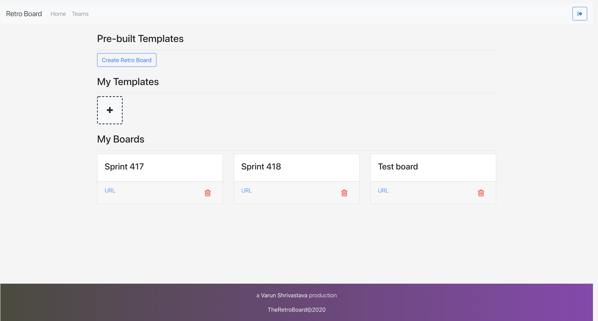
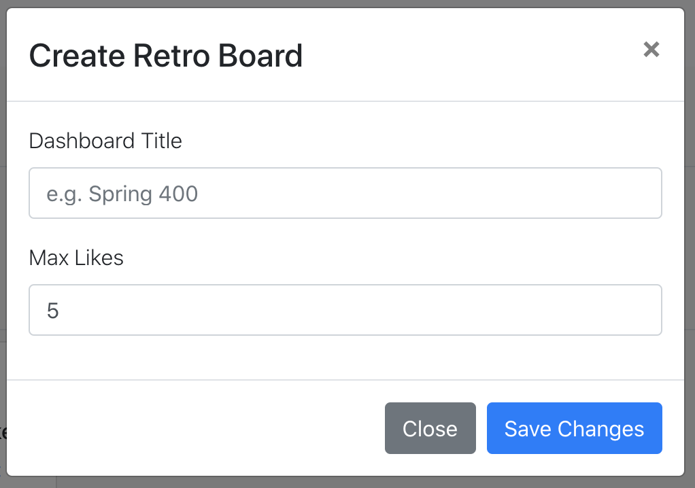
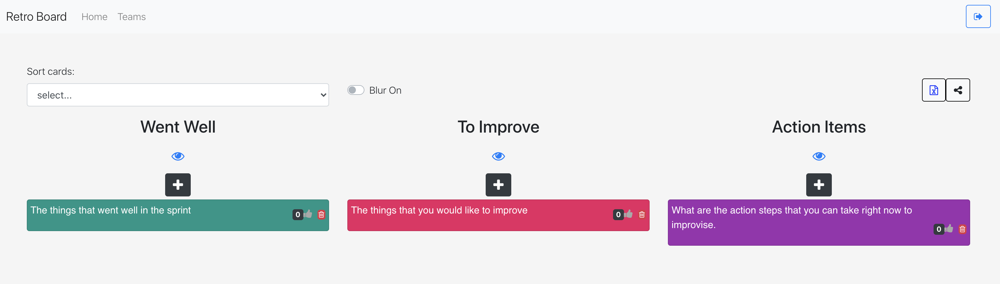
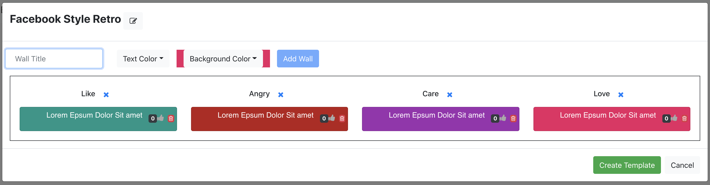
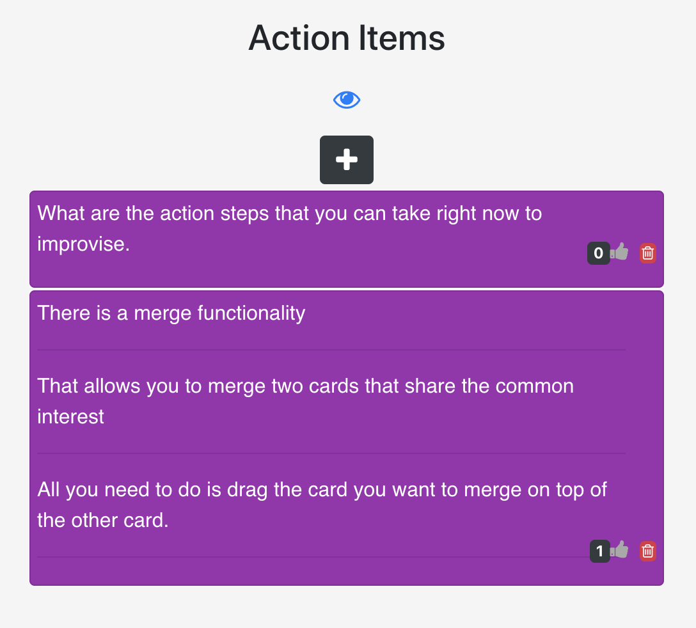
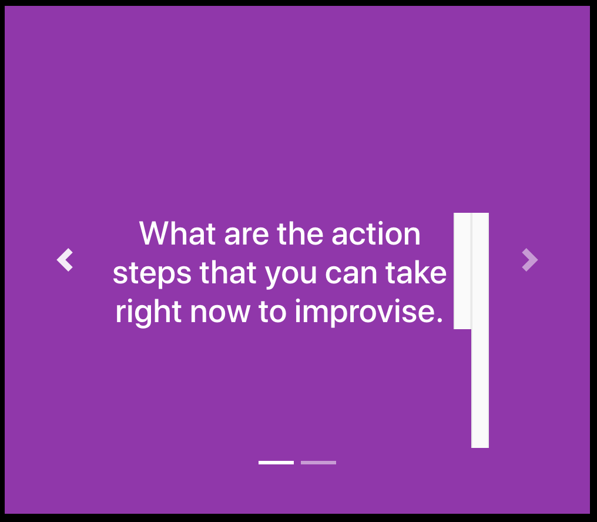

## Retro Board Frontend

It is a platform for creating fast and easy
boards with colorful walls. This platform allows
building new boards using the cutom/pre-built template
for running meetings like retrospective, brainstorming, 
debate, points making etc etc...

## Features

- Google Login
- Anonymous Login
- Create teams
- Add members to your team that will have private access to the boards
- Create Private boards and share with your team
- Create board templates for later use
- Create boards from the template
- Real time updates on the boards that can support large group of people seamlessly
- Voting 
- Sorting on the basis of votes so that most important points can be talked first
- Blur Feature - Blur the
text for other team members until they have put down their thoughts.
This feature could be useful in a way that others won't be influenced by your thoughts.
After everyone adds their thoughts, it can be un-blurred.
- Slideshow view to take up each individual's thought at a time
- Export your board into a CSV file

## Screenshots

## Design & Architecture

coming soon...

## Developer

**Varun Shrivastava**

### About
I have 4 years of experience in building enterprise 
software systems in finance and retail domain. 
Experienced in design, development, and deployment of 
scalable software. Highly dependable and enthusiastic 
team player who loves contributing to open source 
and developing software with best practices.

